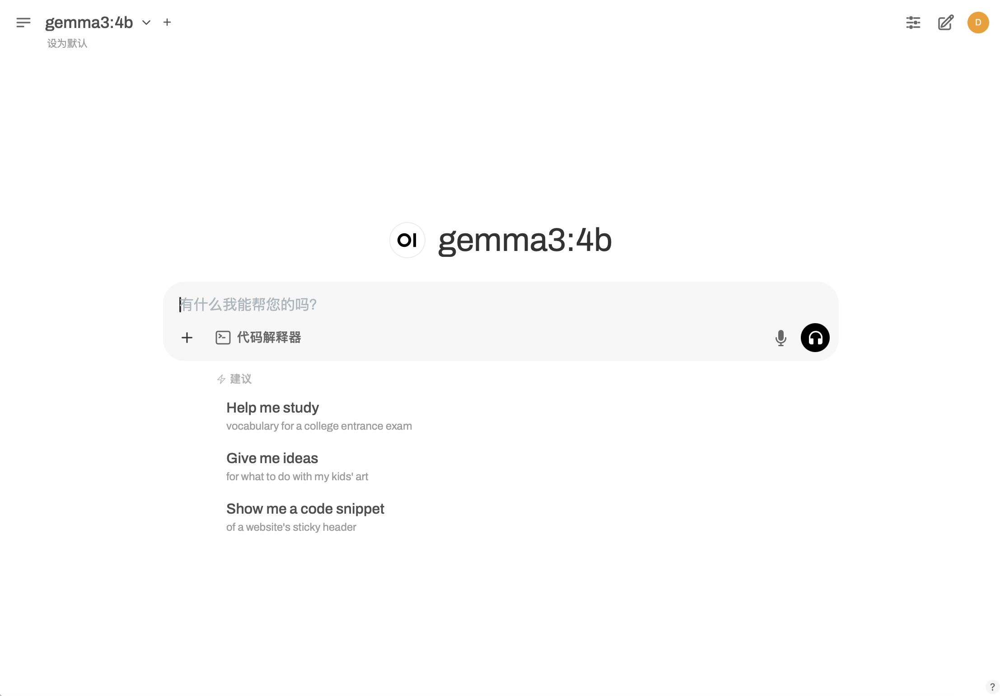
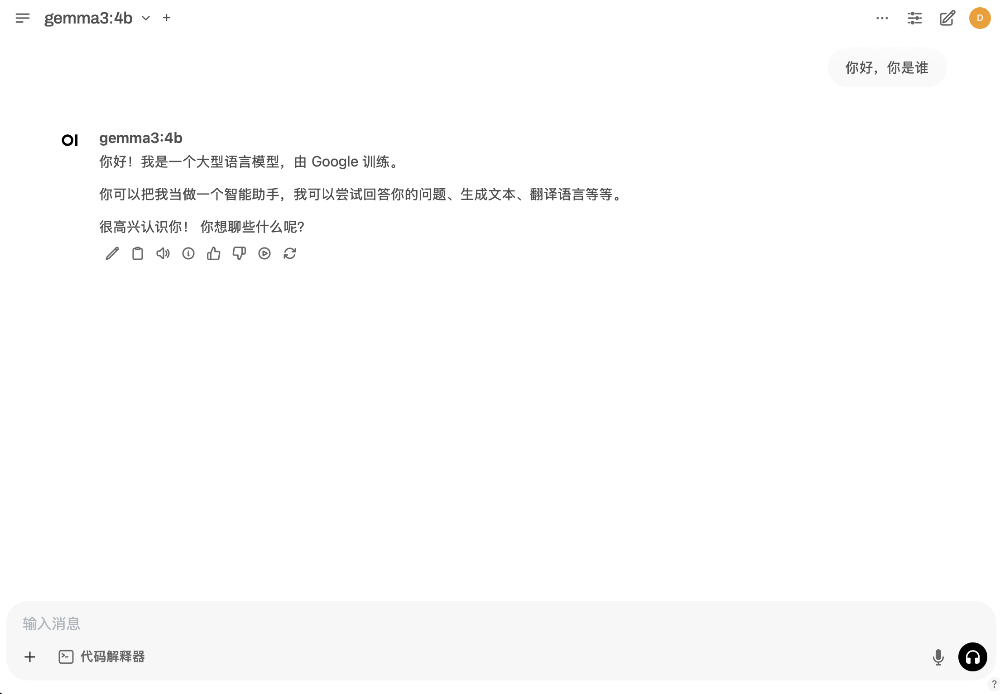

# ollama + open-webui 部署 Gemma 4 E4B-it 模型

> 权重与能力说明见 [google/gemma-4-E4B-it](https://huggingface.co/google/gemma-4-E4B-it) 与 [Gemma 4 博文](https://huggingface.co/blog/gemma4)。本地推理也可使用 llama.cpp：`llama-server -hf ggml-org/gemma-4-E4B-it-GGUF`。

Ollama 是一个开源的大语言模型服务工具，旨在帮助用户快速在**本地**运行大模型。

Open WebUI 是一个**可扩展、功能丰富、用户友好的自托管WebUI**，旨在完全离线操作。它支持各种LLM运行程序，包括Ollama和OpenAI兼容的API。

本教程使用 Ollama **本地部署**与 Hugging Face 上 `google/gemma-4-E4B-it` 对应的 **`gemma4:e4b`** 标签（以 [Ollama Library](https://ollama.com/library/gemma4) 为准），并用 Open WebUI 部署 Web 界面。

## 环境准备

```
ubuntu 22.04
python  3.12
pytorch 2.5.1
cuda 12.4
```

本文默认学习者已安装好如上环境，如未安装请自行安装。

## 安装 ollama

### 1. macOS和Windows系统安装

macOS用户通过[此安装包链接](https://ollama.com/download/Ollama-darwin.zip)下载安装ollama

Windows用户通过[此安装包链接](https://ollama.com/download/OllamaSetup.exe)下载安装ollama

### 2. Linux系统安装

方案一：在终端输入以下命令，**自动安装ollama**

```bash
curl -fsSL https://ollama.com/install.sh | sh
```

方案二：在终端输入以下命令，**手动安装ollama**

```bash
curl -L https://ollama.com/download/ollama-linux-amd64.tgz -o ollama-linux-amd64.tgz
sudo tar -C /usr -xzf ollama-linux-amd64.tgz
```
如果出现无法下载安装包的情况，修改GitHub镜像源之后再下载安装

```bash
curl -L https://git.886.be/https://github.com/ollama/ollama/releases/download/v0.6.0/ollama-linux-amd64.tgz -o ollama-linux-amd64.tgz
sudo tar -C /usr -xzf ollama-linux-amd64.tgz
```

> 考虑到部分同学配置环境可能会遇到一些问题，我们在 AutoDL 平台准备了 gemma-4-E4B-it 的环境镜像，点击下方链接并直接创建 Autodl 示例即可。
> ***https://www.codewithgpu.com/i/datawhalechina/self-llm/self-llm-gemma4***


## 运行 ollama

```bash
ollama serve
```

## 下载并运行 Gemma 4 E4B（Ollama：`gemma4:e4b`）

```bash
ollama run gemma4:e4b
```

## 查看模型运行状态，以检测是否运行模型

```bash
ollama ps
```

## 下载 open-webui

```bash
# 升级 pip
python -m pip install --upgrade pip
# 更换 pypi 源加速库的安装
pip config set global.index-url https://pypi.tuna.tsinghua.edu.cn/simple

pip install open-webui==0.5.20
```

## 运行 open-webui

```bash
open-webui serve
```

openwebui默认在8080端口运行，如需修改服务端口，请输入如下命令：

```bash
open-webui serve --port 6006
```

如果出现 `Connection to huggingface.co timed out` 等报错，添加环境变量修改镜像源后再运行服务：

```bash
export HF_ENDPOINT=https://hf-mirror.com
```

## 访问 open-webui

打开浏览器，访问 http://localhost:6006 即可访问 open-webui。

在开启 Ollama 服务并运行 `gemma4:e4b` 后，Open WebUI 会**自动检测**本地 Ollama 并选用该模型。



## 测试 Gemma 4 E4B-it 可用性

